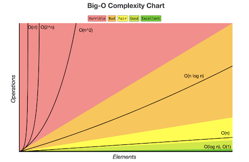

# BigO Notation Cheatsheet

BigO Notation is a way to determine how fast a program can run, like sorts and searches.
`n` is the number of items in the dataset.

## Time Complexities (in order from fastest to slowest)



### `O(1)` - Constant Time

This is instant time. This includes things like:

- Math Equations `(10 + 2)`
- Printing
- Accessing elements of an `Array` / `Arraylist`
- Accessing elements of a `HashMap` / `HashSet`

### `O(log(n))` - Logarithmic Time

This is essentially running a `for i loop` from `0 to n` and another `for loop` running from `i to n`. Includes things such as:

- Worst Space Complexity of `Quicksort`

Example:

``` java
for (int i = 0; i < n; i++)
    for (int j = i; j < n; j++)
        System.out.println(i + j);
```

### `O(n)` - Linear Time

A basic `for loop`, where `n` is the number of elements. This includes:

- Looping over an `Array` / `Arraylist`
- Basic Loop search

Example:

``` java
for (int i = 0; i < n; i++)
    System.out.println(i);
```

### `O(n*log(n))` - Loglinear Time

Loglinear time. Includes:

- Best / Average case `Quicksort`
- Best / Average / Worse case `Mergesort`
- Best / Average / Worse case `Heapsort`

### `O(n^2)` - Quadratic Time

Two `for loops`, each looping from `0 to n`. Includes:

- Worst case `Quicksort`
- Average / Worst case `Bubble Sort`
- Average / Worst case `Insertion Sort`
- Best / Average / Worst case `Selection Sort`

### `O(2^n)` - Exponential Time

Includes things like:

- Getting Combinations

### `O(n!)` - Factorial Time

Worst time complexity. Includes things like:

- Traveling Salesman Problem

## Links

- [BigO Examples](https://javachallengers.com/big-o-notation-explanation/)
