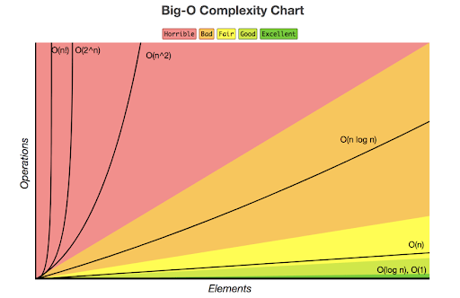

# Global Cheatsheet

- [Global Cheatsheet](#global-cheatsheet)
  - [Number Bases Cheatsheet](#number-bases-cheatsheet)
    - [Common Bases](#common-bases)
    - [Letter Representations](#letter-representations)
    - [Converting Between Bases](#converting-between-bases)
    - [Java Functions](#java-functions)
    - [Base Prefixes](#base-prefixes)
    - [Twos compilment (Signed values)](#twos-compilment-signed-values)
  - [BigO Notation Cheatsheet](#bigo-notation-cheatsheet)
    - [Time Complexities (in order from fastest to slowest)](#time-complexities-in-order-from-fastest-to-slowest)
      - [`O(1)` - Constant Time](#o1---constant-time)
      - [`O(log(n))` - Logarithmic Time](#ologn---logarithmic-time)
      - [`O(n)` - Linear Time](#on---linear-time)
      - [`O(n*log(n))` - Loglinear Time](#onlogn---loglinear-time)
      - [`O(n^2)` - Quadratic Time](#on2---quadratic-time)
      - [`O(2^n)` - Exponential Time](#o2n---exponential-time)
      - [`O(n!)` - Factorial Time](#on---factorial-time)
    - [Links](#links)
  - [Math Cheatsheet](#math-cheatsheet)
    - [Constants](#constants)
    - [Functions](#functions)
    - [Function Examples](#function-examples)
    - [Random in range](#random-in-range)
    - [Links](#links-1)
  - [Primitives Cheatsheet](#primitives-cheatsheet)
    - [Primitive Types](#primitive-types)
    - [Integer Division](#integer-division)
    - [Modulus](#modulus)
    - [Number Suffixes](#number-suffixes)
    - [Default Values](#default-values)
    - [Links](#links-2)
  - [Strings Cheatsheet](#strings-cheatsheet)
    - [String Basics](#string-basics)
    - [String Indexes](#string-indexes)
    - [Important Functions](#important-functions)
    - [Function Examples](#function-examples-1)
    - [Conversions](#conversions)
    - [Links](#links-3)


## Number Bases Cheatsheet

### Common Bases

| Base ## |     |     |        |       |      |     |     |     |
| ------- | --- | --- | ------ | ----- | ---- | --- | --- | --- |
| Base 2  | 128 | 64  | 32     | 16    | 8    | 4   | 2   | 1   |
| Base 8  |     |     | 32768  | 4096  | 512  | 64  | 8   | 1   |
| Base 10 |     |     | 100000 | 10000 | 1000 | 100 | 10  | 1   |
| Base 16 |     |     |        |       | 4096 | 256 | 16  | 1   |

### Letter Representations

| `A` | `B` | `C` | `D` | `E` | `F` |
| --- | --- | --- | --- | --- | --- |
| 10  | 11  | 12  | 13  | 14  | 15  |

### Converting Between Bases

- Can only only convert between bases that is a power of that base
- Split into block sizes, where `x` is the original base, and `y` is the base to convert to:
  - Converting to higher base: `logₓ(y)`
  - Converting to lower base: `ʸ√x`
- Blocks form from right to left.
- When converting to a higher base:
  - Take each block to base `10`, then put them together.
- When converting to a lower base:
  - Take each block and make it into the base you are converting to.
  - If necessary, pad each block to the size it must be

### Java Functions

| Function Name              | Parameters                                                        | Return                                           |
| -------------------------- | ----------------------------------------------------------------- | ------------------------------------------------ |
| `Integer.toString()`       | `int num`: Number in base 10 <br> `int radix`: Base to convert to | `String`: Converted Number as a string           |
| `Integer.toBinaryString()` | `int num`: Number in base 10                                      | `String`: Converted Number in Base 2 as a string |

### Base Prefixes

| Base | Prefix |
| ---- | ------ |
| `2`  | `0b`   |
| `8`  | `0`    |
| `16` | `0x`   |

### Twos compilment (Signed values)

- By default all values in Java are unsigned
- With signed values, make the leftmost value negative:

| Base ## |      |     |     |     |     |     |     |     |
| ------- | ---- | --- | --- | --- | --- | --- | --- | --- |
| Base 2  | -128 | 64  | 32  | 16  | 8   | 4   | 2   | 1   |

## BigO Notation Cheatsheet

BigO Notation is a way to determine how fast a program can run, like sorts and searches.
`n` is the number of items in the dataset.

Each nested for loop adds a power to the complexity. For example, it goes from `n` to `n^2` to `n^3` to `n^4` etc.

Complexities next to each other are added. For example, a `O(n)` algorithm next to a `O(n^2)` algorithm, the final notation is `O(n + n^2)`.

> Two `O(1)` algorithms added together are still `O(1)`

### Time Complexities (in order from fastest to slowest)



#### `O(1)` - Constant Time

This is instant time. This includes things like:

- Math Equations `(10 + 2)`
- Printing
- Accessing elements of an `Array` / `Arraylist`
- Accessing elements of a `HashMap` / `HashSet`

#### `O(log(n))` - Logarithmic Time

This is essentially running a `for i loop` from `0 to n` and another `for loop` running from `i to n`. Includes things such as:

- Worst Space Complexity of `Quicksort`

Example:

```java
for (int i = 0; i < n; i++)
    for (int j = i; j < n; j++)
        System.out.println(i + j);
```

#### `O(n)` - Linear Time

A basic `for loop`, where `n` is the number of elements. This includes:

- Looping over an `Array` / `Arraylist`
- Basic Loop search

Example:

```java
for (int i = 0; i < n; i++)
    System.out.println(i);
```

#### `O(n*log(n))` - Loglinear Time

Loglinear time. Includes:

- Best / Average case `Quicksort`
- Best / Average / Worse case `Mergesort`
- Best / Average / Worse case `Heapsort`

#### `O(n^2)` - Quadratic Time

Two `for loops`, each looping from `0 to n`. Includes:

- Worst case `Quicksort`
- Average / Worst case `Bubble Sort`
- Average / Worst case `Insertion Sort`
- Best / Average / Worst case `Selection Sort`

Example:

```java
for (int i = 0; i < n; i++)
    for (int j = 0; j < n; j++)
        System.out.println(i + j);
```

#### `O(2^n)` - Exponential Time

Includes things like:

- Getting Combinations

#### `O(n!)` - Factorial Time

Worst time complexity. Includes things like:

- Traveling Salesman Problem

### Links

- [BigO Examples](https://javachallengers.com/big-o-notation-explanation/)

## Math Cheatsheet

The `Math` class does **not** need to be imported

### Constants

All constants are `doubles`

| Constant  | Value |
| --------- | ----- |
| `Math.PI` | `π`   |
| `Math.E`  | `E`   |

### Functions

> Functions with a type of `number` accept types `double`, `float`, `int`, `long`
> The return type will match the parameter type

| Function Name      | Parameters                | Return                                              |
| ------------------ | ------------------------- | --------------------------------------------------- |
| `Math.abs() *`     | `number a`                | `number`: Absolute Value                            |
| `Math.pow()`       | `double a`, `double b`    | `double`: `a` to the power of `b`                   |
| `Math.sqrt()`      | `double a`                | `double`: The square root of `a`                    |
| `Math.cbrt()`      | `double a`                | `double`: The cube root of `a`                      |
| `Math.min()`       | `number a`, `number b`    | `number`: Smallest number between `a` and `b`       |
| `Math.max()`       | `number a`, `number b`    | `number`: Largest number between `a` and `b`        |
| `Math.sin()`       | `double a` **in radians** | `double`: trigonometric sine of an angle            |
| `Math.cos()`       | `double a` **in radians** | `double`: trigonometric cosine of an angle          |
| `Math.tan()`       | `double a` **in radians** | `double`: trigonometric tangent of an angle         |
| `Math.toRadians()` | `double a` **in degrees** | `double`: Converts degrees to radians               |
| `Math.hypot()`     | `double a`, `double b`    | `double`: Hypotenuse of a triangle (`sqrt(x2 +y2)`) |
| `Math.floor()`     | `double a`                | `double`: Truncates `a`                             |
| `Math.ceil()`      | `double a`                | `double`: Rounds `a` up to the nearest whole number |
| `Math.round()`     | `double a`                | `long`: `a` rounded to the nearest whole number     |
| `Math.round()`     | `float a`                 | `int`: `a` rounded to the nearest whole number      |
| `Math.random()`    |                           | `double`: Random number in the range `0 <= x < 1`   |

### Function Examples

```java
Math.abs(-3) = 3;
Math.pow(7, 2) = 49.0;
Math.sqrt(64) = 8.0;
Math.cbrt(64) = 4.0;
Math.min(2, 4) = 2;
Math.max(2, 4) = 4;
Math.sin(0) = 0.0;
Math.cos(Math.PI) = -1.0;
Math.tan(0) = 0.0;
Math.toRadians(90) = 1.5707;
Math.hypot(3, -4) = 5.0;
Math.floor(4.8) = 4.0;
Math.ceil(4.8) = 5.0;
Math.round(4.5) = 5;
```

### Random in range

```java
// Returns a number between min (inclusive) and max (inclusive)
public static randInRange(int min, int max) {
    return (int)(Math.random() * ((max - min) + 1)) + min;
}
```

### Links

- [Math Class Documentation](https://docs.oracle.com/javase/8/docs/api/java/lang/Math.html)

## Primitives Cheatsheet

### Primitive Types

| Name      | Bits | Signed | Range                                                    |
| --------- | ---- | ------ | -------------------------------------------------------- |
| `boolean` | `8`  | `No`   | `false` or `true`                                        |
| `byte`    | `8`  | `Yes`  | `-128` to `127`                                          |
| `char`    | `16` | `No`   | `0` to `65535`                                           |
| `short`   | `16` | `Yes`  | `-32768` to `32767`                                      |
| `int`     | `32` | `Yes`  | `-2147483648` to `2147483647`                            |
| `long`    | `64` | `Yes`  | `-9223372036854775808` to `9223372036854775807`          |
| `float`   | `32` |        | `1.40239846e-45` to `3.40282347e+38`                     |
| `double`  | `64` |        | `4.94065645841246544e-324` to `1.79769313486231570e+308` |

### Integer Division

- Division between two `number` values (`byte`, `short`, `int`, `long`) will truncate the decimal.
- Division between a decimal value (`float`, `double`) and a `number` value will produce a decimal.

```java
2 / 3 = 0
16 / 5 = 3
8 / 4 = 2
-10 / 7 = -1
2.0 / 3 = 0.6666
16 / 5. = 3.2
(double) 1 / 6 = 0.1666
9d / 4 = 2.25
```

### Modulus

- `%` symbol takes the remainder

```java
16 % 2 == 0;
x % 2 == 0;  // Is x even?
x % 3 != 0;  // Is x NOT a multiple of 3
```

### Number Suffixes

Certain Data types have suffixes that specify what type they are.
**Not using these may cause errors**

```java
long l = 12345L;
float f = 100.123f;
double d = 9876.12345d;
```

### Default Values

If no value is specified, the types will default to:

| Data Type              | Default Value |
| ---------------------- | ------------- |
| `byte`, `short`, `int` | `0`           |
| `float`                | `0f`          |
| `double`               | `0d`          |
| `long`                 | `0L`          |
| `char`                 | `'\u0000'`    |
| `Object`               | `null`        |
| `boolean`              | `false`       |

### Links

- [Official Primitives Guide](https://docs.oracle.com/javase/tutorial/java/nutsandbolts/datatypes.html)
- [W3 Schools Data Types Guide](https://www.w3schools.com/java/java_data_types.asp)

## Strings Cheatsheet

### String Basics

Strings are **immutable** (cannot change)
Strings are **objects** (not primatives)

```java
// Creation
String s = "Hello, World!";
s = "Change the value";
String s = new String("Hello, World");
// Concatination
s = s + "Addition";
```

### String Indexes

Indexes start at `0`

| String | H   | e   | l   | l   | o   |
| ------ | --- | --- | --- | --- | --- |
| Index  | 0   | 1   | 2   | 3   | 4   |

### Important Functions

| Function Name                      | Parameter List                                                                                                                                                     | Return                                                                                                                                                  |
| ---------------------------------- | ------------------------------------------------------------------------------------------------------------------------------------------------------------------ | ------------------------------------------------------------------------------------------------------------------------------------------------------- |
| `s.length()`                       |                                                                                                                                                                    | `int`: the length of the string                                                                                                                         |
| `s.substring()`                    | `int start`: Start index of your substring <br> `int end` End index of your substring                                                                              | `String`: A substring of `s` from indecies `start` to `end - 1`                                                                                         |
| `s.substring()`                    | `int start`: Start index of your substring                                                                                                                         | `String`: A substring for index `start` to the end of the string                                                                                        |
| `s.indexOf()`                      | `String str`: String to search for within the string                                                                                                               | `int`: if `str` is found inside `s`, then it gives the index where it is found, if not returns `-1`                                                     |
| `s.indexOf()`                      | `String str`: String to search for within the string <br> `int i`: Index to start your search                                                                      | `int`: if `str` is found inside `s` after index `i`, then it gives the index where it is found, if not returns `-1`                                     |
| `s.lastIndexOf()`                  | `String str`: String to search for within the string                                                                                                               | `int`: if `str` is found within `s`, it gives the index of the last occurence of that `str`, otherwise returns `-1`                                     |
| `s.charAt()`                       | `int i`: Index in the string                                                                                                                                       | `char`: Returns the character at index `i`                                                                                                              |
| `s.compareTo()`                    | `String str`: String to compare to                                                                                                                                 | `int`: returns the ascii difference between the first different characters going left to right                                                          |
| `s.equals()`                       | `String other`: String to compare to                                                                                                                               | `boolean`: `true` if they are equal to one another, `false` otherwise. **Do NOT use ==**                                                                |
| `s.equalsIgnoreCase()`             | `String other`: String to compare to                                                                                                                               | `boolean`: `true` if they are equal to one another, ignoring whether or not the letters are uppercase / lowercase, `false` otherwise. **Do NOT use ==** |
| `s.split()`                        | `String regex`: String to split by                                                                                                                                 | `String[]`: Array with the string broken up by the regex                                                                                                |
| `s.contains()`                     | `String str`: String to check against                                                                                                                              | `boolean`: Whether or not `str` appears within `s`                                                                                                      |
| `s.startsWith()`                   | `String str`: String to check against                                                                                                                              | `boolean`: Whether or not `s` starts with `str`                                                                                                         |
| `s.endsWith()`                     | `String str`: String to check against                                                                                                                              | `boolean`: Whether or not `s` ends with `str`                                                                                                           |
| `s.repeat()`                       | `int n`: Number of times to repeat the String`                                                                                                                     | `String`: String containing `n` copies of `s`                                                                                                           |
| `s.strip()`                        |                                                                                                                                                                    | `String`: `s` that has all trailing or leading whitespace                                                                                               |
| `s.stripLeading()`                 |                                                                                                                                                                    | `String`: `s` that has all leading whitespace                                                                                                           |
| `s.stripTrailing()`                |                                                                                                                                                                    | `String`: `s` that has all trailing whitespace                                                                                                          |
| `s.toCharArray()`                  |                                                                                                                                                                    | `char[]`: Character array of all the characters in the string                                                                                           |
| `s.replace()` / `s.replaceFirst()` | Both paramters allow use of regex <br> `String a` or `char a`: String to search for in `s` <br> `String b` or `char b`: String to replace the first instance with. | `String`: String with the first instance of `a` replaced with `b`                                                                                       |
| `s.replaceAll()`                   | Both paramters allow use of regex <br> `String a` or `char a`: String to search for in `s` <br> `String b` or `char b`: String to replace each instance with.      | `String`: String with all instance of `a` replaced with `b`                                                                                             |
| `s.matches()`                      | `String regex`: Regular Expression to check against                                                                                                                | `boolean`: If String `s` is valid for regex `regex`                                                                                                     |
| `s.toUpperCase()`                  |                                                                                                                                                                    | `String`: `s` with all characters converted to uppercase                                                                                                |
| `s.toLowerCase()`                  |                                                                                                                                                                    | `String`: `s` with all characters covnerted to lowercase                                                                                                |
| `s.isEmpty()`                      |                                                                                                                                                                    | `boolean`: `true` if `s.length()` is `0`, otherwise `false`                                                                                             |
| `s.isBlank()`                      |                                                                                                                                                                    | `boolean`: `true` if `s.strip().length()` is `0`, otherwise `false`                                                                                     |

### Function Examples

```java
String s = "Hello";

out.println(s.length());            // Prints out 5
out.println(s.substring(2, 4));     // Prints out ll
out.println(s.substring(1));        // Prints out ello
out.println(s.indexOf("ll"));       // Prints out 2
out.println(s.indexOf("ellooo"));   // Prints out -1
out.println(s.indexOf("He", 3));    // Prints out -1
out.println(s.lastIndexOf("l"));    // Prints out 3
out.println(s.charAt(3));           // Prints out 3
out.println(s.compareTo("Hello"));  // Prints out 0
out.println(s.equals("Hello"));     // Prints out true
out.println(s.equals("hello"));     // Prints out true
out.println(s == "Hello");          // Prints out false
out.println(s.split("e"));          // Prints out ["H", "llo"]
out.println(s.split(""));           // Prints out ["H", "e", "l", "l", "o"]
out.println(s.contains("ll"));      // Prints out true
out.println(s.startsWith("He"));    // Prints out true
out.println(s.endsWith("lo"));      // Prints out true
out.println(s.repeat(3));           // Prints out HelloHelloHello
out.println(s.toCharArray());       // Prints out ['H', 'e', 'l', 'l', 'o']
out.println(s.replace("ll", "oo")); // Prints out Heooo
out.println(s.matches(".+"));       // Prints out true
out.println(s.toUpperCase());       // Prints out HELLO
out.println(s.toLowerCase());       // Prints out hello
```

### Conversions

```java
String s;
i + "";              // Any number (i) to String
s.charAt(0);         // String to char
Integer.parseInt(s); // String to int
Integer.valueOf(s);  // String to Integer (class)
String.valueOf(x);   // Any primitive (x) to String
```

### Links

- [Official Strings Documentation](https://docs.oracle.com/en/java/javase/22/docs/api/java.base/java/lang/String.html)
- [W3 Schools String Reference](https://www.w3schools.com/java/java_ref_string.asp)
- [W3 Schools String Guide](https://www.w3schools.com/java/java_strings.asp)
